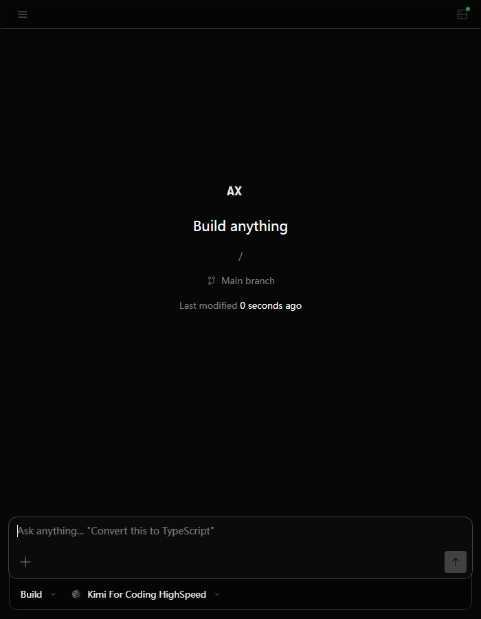

# Axon Developer Agent

Use Axon as an AI coding agent in the VS Code sidebar. Work with the current folder, review changes, switch models, and continue existing Axon sessions without leaving the editor.



## Features

- Run the full Axon conversation experience in VS Code's secondary sidebar.
- Use the open workspace as project context without creating a visible terminal.
- Review files and diffs, approve tools and permissions, and manage sessions from the editor.
- Use the same providers, models, credentials, and preferences as the Axon CLI.
- Keep the local runtime private: the extension starts `axon serve` on a loopback address with a random per-process password.

## Install

Install the Axon CLI first:

```sh
npm install -g @wanghuimvp/axon@latest
```

Configure at least one provider through the CLI, then install this extension from the Visual Studio Marketplace.

Open a folder in VS Code and run **Axon: Open Sidebar** from the Command Palette. Axon also appears in the secondary sidebar.

## Shared CLI Configuration

The extension starts the installed Axon CLI, so it automatically uses the same configuration as the terminal application:

- `~/.axon/axon.jsonc` for providers and server settings
- `~/.axon/tui.json` for interface preferences
- the same Axon state directory for recent models and sessions

There is no separate VS Code provider login. Changes made by either interface are available to the other.

## Requirements

- VS Code 1.94 or later
- Axon CLI available on `PATH`
- Windows, macOS, or Linux on a platform supported by the Axon npm package

If the extension cannot locate the CLI, verify it from a terminal with `axon --version`. A custom executable path can be set with `axon.server.command` in VS Code settings.

## Troubleshooting

- Run **Axon: Restart Local Server** after changing CLI configuration or upgrading Axon.
- Open a folder before starting the sidebar; Axon uses that folder as its workspace.
- If a model works in the CLI but not in VS Code, restart the sidebar so it reloads the current CLI model state.
- Report reproducible problems in the [Axon issue tracker](https://github.com/Wade-DevCode/axon/issues).

## Project

Axon is developed by Wang Hui and released under the MIT License. Source code, releases, and documentation are available in the [Axon GitHub repository](https://github.com/Wade-DevCode/axon).

## Extension Development

Open `sdks/vscode` as the VS Code workspace, run `bun install`, and press `F5`. Use **Developer: Reload Window** in the Extension Development Host after rebuilding.
